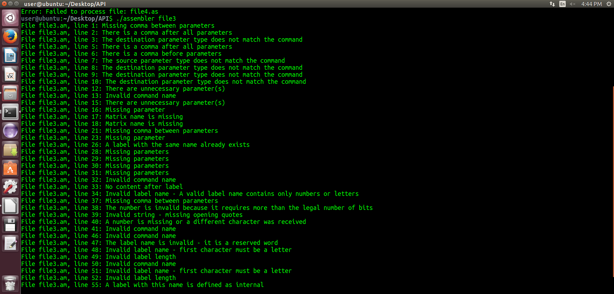

---

# 📁 Two-Pass Assembler in ANSI C

This project was developed as part of **course 20465 (System Programming Lab)** at The Open University.
It implements a **two-pass assembler** in **ANSI C**, capable of translating assembly source files into 16-bit machine code suitable for **loading and linkage**.

## 👥 Authors
Developed collaboratively as part of course 20465:
* **Ruti Segal**
* **Esti Aker**

## ✨ Key Features
*  **Pre-processor Macro Expansion:** Automatically expands `.mcro` blocks before parsing.
*  **Two-Pass Translation:** Efficient symbol-table resolution and binary machine code generation.
*  **Full Addressing Support:** Direct, Immediate, Index, and Register Direct modes.
*  **Zero-Tolerance Warning Compilation:** Built with strict flags (`-Wall -ansi -pedantic`).

---

## 🛠️ Project Requirements and Compilation

### Compilation

The project must be compiled using the **gcc** compiler with the following strict flags:

```bash
gcc -Wall -ansi -pedantic
```

The code must compile **without any warnings** under these flags.

###  How to Run and Usage

1. Build the executable:
   make

2. Run the assembler:
   Pass the names of the assembly source files (without the .as extension) as arguments. For example:
   ./assembler examples/file1 examples/file2

   This will process examples/file1.as and examples/file2.as.

3. Clean build artifacts:
   make clean

---

## 📝 Supported Assembly Language Features

### Instructions and Registers

1. **Instruction Length:** All machine instructions and data words are 16 bits long.
2. **Registers:** Supports **r0 – r7**, represented using **3 bits**.
3. **Addressing Modes:** Four addressing methods (encoded using 2 bits):

   * 0 – Immediate
   * 1 – Direct
   * 2 – Index
   * 3 – Register Direct

### Directives

* `.data`, `.string`, `.mat` — Define data sections.
* **Labels:** Mark memory locations (followed by a colon `:`).
* **Entry/External:**

  * `.entry` — Marks a symbol as an entry point.
  * `.extern` — Declares a symbol as external (defined in another file).

### Macros

The assembler supports macro definitions using `.mcro` and `.mcroend`.
Macro expansion occurs in an initial pre-processing phase before the main two passes.

---

## ⚙️ Assembly Process and Memory Mapping

The assembler operates in **two passes**:

1. **First Pass:**

   * Builds the **Symbol Table** (labels, attributes, and addresses).
   * Calculates instruction and data addresses (IC/DC).

2. **Second Pass:**

   * Resolves symbol references and generates the final machine code.

### Memory Management

* **Starting Address:** Memory begins at address **100**.
* **Symbol Table:** Stores label names, memory addresses, and attributes (code/data/external).

### Output Files

If assembly completes successfully, the following files are produced for each input file:

| File   | Description                           |
| ------ | ------------------------------------- |
| `.ob`  | Object file – translated machine code |
| `.ext` | List of external symbols used         |
| `.ent` | List of entry symbols                 |

Example:

```
prog.as  →  prog.ob, prog.ext, prog.ent
```

### ⚠️ Error Handling

The assembler performs thorough validation during both passes (e.g., syntax errors, undefined labels, or invalid operands). If errors are detected, descriptive error messages are printed to `stdout` with line numbers, and no output files are generated.


*Figure 1: Example of error detection and reporting during assembly.*

---

## 🚀 Encoding Mechanism – From Assembly to 16-bit Machine Code

### A, R, E Fields (Bits 0–1)

The two least significant bits define the reference type:

| Bits (0–1) | Type            | Meaning                                                  |
| :--------: | :-------------- | :------------------------------------------------------- |
|   **00**   | Absolute (A)    | Fixed address reference                                  |
|   **01**   | Relocatable (R) | Refers to an internal label (may be adjusted on linkage) |
|   **10**   | External (E)    | Refers to an externally defined symbol                   |

---

### Instruction Word Format

| Bit Range | Length | Field       | Description                              |
| :-------: | :----- | :---------- | :--------------------------------------- |
|    0–1    | 2      | A, R, E     | Addressing reference bits                |
|    2–3    | 2      | Destination | Addressing method of destination operand |
|    4–5    | 2      | Source      | Addressing method of source operand      |
|    6–9    | 4      | Opcode      | Operation code                           |
|   10–15   | 6      | Misc        | Additional instruction info              |

Specific instructions such as **`bne`** (branch if not equal) use the **Z flag** in the **Program Status Word (PSW)** to control branching behavior.

---

### Register Encoding in Combined Words

When both operands are registers, they are encoded in a single 16-bit word following the main instruction:

* Bits **6–9:** Source Register
* Bits **2–5:** Destination Register
* Bits **0–1:** `00` (Absolute)

---

### Data Encoding

1. **`.data` / `.mat`** — Numeric constants stored as 16-bit words.
2. **`.string`** — Characters stored sequentially (one per 16-bit word), terminated by a **null character (`\0`)** encoded as `0`.

---

## 📚 Notes

* Fully implemented in **ANSI C**.
* Follows the official **20465 assembler specification** and strict compilation rules.
* Designed for modularity, clarity, and accurate two-pass processing.

---
